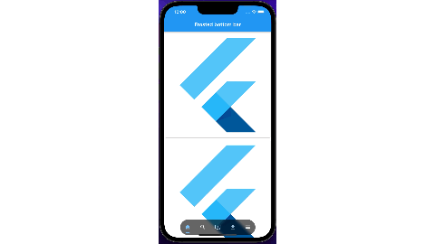

# Floating Frosted Bottom Bar
[](https://pub.dev/packages/fancy_text_reveal)  
A Flutter package that helps you to create a frosted floating bottom navigation bar that also reacts to scrolling events.

# Demo 👀


## Usage 🎨

Wrap any child widget with `FrostedBottomBar` to convert it into frosted bottom bar.
Basic example,

```dart
FrostedBottomBar(
        opacity: 0.6,
        sigmaX: 5,
        sigmaY: 5,
        child: Text(
              "Frosted Bottom Bar Example",
              textAlign: TextAlign.center,
              style: TextStyle(color: Colors.white),
            ),
        body: (context, controller) =>
              ListView.builder(
                  controller: controller,
                  itemBuilder: (context, index) {
                    return const Card(child: FittedBox(child: FlutterLogo()));
                  },
                ),
    )
```

# Detail Usage

Following are the optional properties that can be used inside `FrostedBottomBar`

| Parameter | Example | Action |
|:---|:---|:---|
| sgimaX |```sgimaX: 5``` | Creates an image filter that applies a Gaussian blur |
| sgimaY |```sgimaY: 5``` | Creates an image filter that applies a Gaussian blur |
| opacity |```opacity: 0.6``` | An opacity of 1.0 is fully opaque. An opacity of 0.0 is fully transparent (i.e., invisible). |
| hideOnScroll |```hideOnScroll: false``` | On true it will hide bottom bar on scroll |
| bottomBarColor |```bottomBarColor: Colors.grey``` | Change the bottom bar color |
| start |```start: 2``` | The start position in `y-axis` of the SlideTransition of the `FrostedBottomBar` |
| end |```end: 0``` | The end position in `y-axis` of the SlideTransition of the `FrostedBottomBar`|
| duration |```duration: const Duration(seconds: 1)``` | Set the duration of the `FrostedBottomBar` |
| width |```width: MediaQuery.of(context).size.width * 0.6``` | Set the width for `FrostedBottomBar` |
| borderRadius |```borderRadius: BorderRadius.circular(500)``` | Set the radius of `FrostedBottomBar` |
| reverse |```reverse: true``` | Reverse the direction of scrolling of `FrostedBottomBar` i.e. if you want to make the bar visible when you scroll down and hide it when you scroll up, set this to `true`|
| alignment |```alignment: Alignment.bottomCenter``` | Set the alignment of `FrostedBottomBar` |
| fit |```fit: StackFit.loose``` |The fit property of the Stack in which the `FrostedBottomBar` is placed |
| alignment |```alignment: Alignment.bottomCenter``` | Set the alignment of `FrostedBottomBar` |
